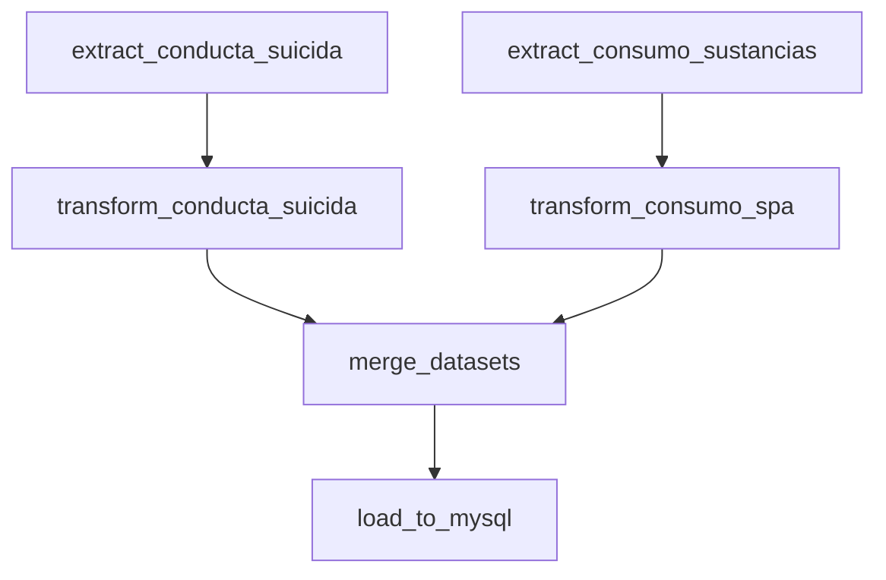

# 🏥 ODS3: Análisis de Suicidio y Consumo de Sustancias Psicoactivas en Bogotá

[](https://airflow.apache.org/)
[](https://www.python.org/)
[](https://www.mysql.com/)
[](https://www.docker.com/)

## 📋 Descripción del Proyecto

Este proyecto implementa un pipeline ETL (Extract, Transform, Load) automatizado con Apache Airflow para analizar la relación entre el consumo de sustancias psicoactivas (SPA) y la conducta suicida en Bogotá, Colombia. Los datos se procesan, transforman y cargan en un modelo dimensional (star schema) en MySQL para facilitar el análisis y generación de insights.

### 🎯 Objetivo

Contribuir al **Objetivo de Desarrollo Sostenible 3 (ODS 3)** - Salud y Bienestar, mediante el análisis de datos abiertos para identificar patrones y factores de riesgo asociados al consumo de sustancias y conductas suicidas en diferentes poblaciones de Bogotá.

## 🏗️ Arquitectura del Proyecto

```
┌──────────────────────────────────────────────────────────────┐
│                      CAPA DE EXTRACCIÓN                       │
├──────────────────────────────────────────────────────────────┤
│  📡 API Datos Abiertos Bogotá  │  📄 CSV Local               │
│  (Conducta Suicida)            │  (Consumo SPA)              │
└──────────────┬──────────────────┴──────────────┬─────────────┘
               │                                  │
               ▼                                  ▼
┌──────────────────────────────────────────────────────────────┐
│                   CAPA DE TRANSFORMACIÓN                      │
├──────────────────────────────────────────────────────────────┤
│  🔄 Limpieza y estandarización de datos                      │
│  🔄 Formato Tidy Data                                        │
│  🔄 Control de calidad (QC)                                  │
│  🔄 Merge de datasets                                        │
│  🔄 Cálculo de porcentajes y agregaciones                    │
└──────────────┬───────────────────────────────────────────────┘
               │
               ▼
┌──────────────────────────────────────────────────────────────┐
│                      CAPA DE CARGA                            │
├──────────────────────────────────────────────────────────────┤
│  🗄️ MySQL - Modelo Dimensional (Star Schema)                │
│     • dim_tiempo (año)                                       │
│     • dim_ubicacion (UPZ)                                    │
│     • dim_perfil_demografico (sexo, edad, educación)         │
│     • dim_clasificacion (tipo de evento)                     │
│     • fact_casos (métricas y agregaciones)                   │
└──────────────────────────────────────────────────────────────┘
```

## 🚀 Características Principales

- ✅ **Pipeline ETL Automatizado**: Orquestado con Apache Airflow
- ✅ **Extracción Multi-fuente**: API REST y archivos CSV
- ✅ **Transformación Robusta**: Limpieza, validación y formato tidy
- ✅ **Control de Calidad**: Reportes JSON con métricas de calidad
- ✅ **Modelo Dimensional**: Star schema optimizado para análisis
- ✅ **Dockerizado**: Fácil despliegue con Docker Compose
- ✅ **Escalable**: Procesamiento por lotes y optimizado
- ✅ **Logging Completo**: Trazabilidad de todo el proceso

## 🛠️ Tecnologías Utilizadas

| Tecnología | Versión | Propósito |
|------------|---------|-----------|
| **Apache Airflow** | 2.5.1 | Orquestación del pipeline ETL |
| **Python** | 3.8+ | Lenguaje de programación principal |
| **Pandas** | 2.3.3 | Procesamiento y análisis de datos |
| **MySQL** | 8.0 | Base de datos relacional |
| **Docker** | Latest | Contenedorización de servicios |
| **PostgreSQL** | 13 | Metadata de Airflow |
| **Redis** | Latest | Message broker para Celery |

## 📊 Modelo de Datos

### Dimensiones

#### 📅 `dim_tiempo`
- **id_tiempo** (PK)
- anio

#### 📍 `dim_ubicacion`
- **id_ubicacion** (PK)
- upz (Unidad de Planeamiento Zonal)

#### 👤 `dim_perfil_demografico`
- **id_perfil** (PK)
- sexo
- ciclo_vida
- nivel_educativo

#### 🏷️ `dim_clasificacion`
- **id_clasificacion** (PK)
- clasificacion (tipo de evento: intento, amenaza, etc.)

### Tabla de Hechos

#### 📈 `fact_casos`
- **id_fact** (PK)
- id_tiempo (FK)
- id_ubicacion (FK)
- id_perfil (FK)
- id_clasificacion (FK)
- **Métricas de casos:**
  - casos_spa, casos_sui
- **Sitios de consumo:**
  - sitio_vivienda, sitio_parque, sitio_est_educativo, sitio_bares_tabernas, sitio_via_publica, sitio_casa_amigos
  - pct_sitio_* (porcentajes)
- **Factores de riesgo:**
  - enfermedades_dolorosas, maltrato_sexual, muerte_familiar, conflicto_pareja, problemas_economicos, esc_educ, problemas_juridicos, problemas_laborales, suicidio_amigo
  - pct_* (porcentajes)

## 🔄 Pipeline ETL

### Flujo de Tareas



### Descripción de Tareas

1. **extract_conducta_suicida** 📡
   - Extrae datos de la API de Datos Abiertos Bogotá
   - Endpoint: https://datosabiertos.bogota.gov.co
   - Paginación automática (32,000 registros por página)
   - Guarda CSV en `notebooks/data/conductasuicida.csv`

2. **extract_consumo_sustancias** 📄
   - Lee archivo CSV local de consumo de SPA
   - Ruta: `notebooks/data/consumosustancias.csv`

3. **transform_conducta_suicida** 🔄
   - Limpieza y estandarización de datos
   - Separación de clasificaciones múltiples
   - Formato tidy data
   - Genera reporte QC: `data_out/suicida_qc.json`
   - Salida: `data_out/suicida_tidy.csv`

4. **transform_consumo_spa** 🔄
   - Normalización de campos
   - Transformación a formato tidy
   - Genera reporte QC: `data_out/spa_qc.json`
   - Salida: `data_out/spa_tidy.csv`

5. **merge_datasets** 🔗
   - Combina datasets transformados
   - Join tipo: INNER (por año, UPZ, sexo, ciclo_vida, nivel_educativo)
   - Calcula porcentajes de todas las variables
   - Genera reporte QC: `data_out/merge_qc.json`
   - Salida: `data_out/merged_spa_suicidas.csv`

6. **load_to_mysql** 🗄️
   - Crea base de datos si no existe
   - Crea modelo dimensional (tablas dim_* y fact_casos)
   - Carga incremental por lotes (1000 registros)
   - Usa cachés para optimizar inserciones en dimensiones

## 🚦 Instalación y Configuración

### Prerrequisitos

- Docker Desktop instalado
- Docker Compose instalado
- Al menos 4 GB de RAM disponible
- 10 GB de espacio en disco

### Pasos de Instalación

1. **Clonar el repositorio**
   ```bash
   git clone https://github.com/anniecorrea/ODS3_SUICIDIO_Y_CONSUMO.git
   cd ODS3_SUICIDIO_Y_CONSUMO
   ```

2. **Configurar variables de entorno (opcional)**
   
   Crear archivo `.env` en la raíz:
   ```env
   AIRFLOW_UID=50000
   MYSQL_HOST=mysql
   MYSQL_DATABASE=ODS3_SPA_SUICIDAS
   MYSQL_USER=root
   MYSQL_PASSWORD=airflow
   MYSQL_PORT=3306
   ```

3. **Inicializar Airflow**
   ```bash
   docker-compose up airflow-init
   ```

4. **Levantar todos los servicios**
   ```bash
   docker-compose up -d
   ```

5. **Verificar estado de servicios**
   ```bash
   docker-compose ps
   ```

### Acceso a Servicios

| Servicio | URL | Credenciales |
|----------|-----|--------------|
| **Airflow UI** | http://localhost:8080 | Usuario: `airflow`<br>Contraseña: `airflow` |
| **MySQL** | localhost:3307 | Usuario: `root`<br>Contraseña: `airflow` |

## 📖 Uso del Sistema

### Activar el DAG

1. Acceder a Airflow UI: http://localhost:8080
2. Buscar el DAG: `ods3_etl_suicidio_consumo`
3. Activar el toggle para habilitar el DAG
4. El pipeline se ejecutará diariamente de forma automática

### Ejecución Manual

Para ejecutar el pipeline manualmente:

1. En Airflow UI, hacer clic en el DAG
2. Clic en "Trigger DAG" (botón de play ▶️)
3. Confirmar la ejecución

## 🧪 Testing y Validación

### Ejecutar Tests
```bash
# Entrar al contenedor de Airflow
docker-compose exec airflow-worker bash

# Ejecutar tests unitarios (si existen)
pytest tests/
```

### Validar Carga de Datos
```bash
# Conectar a MySQL
docker-compose exec mysql mysql -u root -pairflow ODS3_SPA_SUICIDAS

# Verificar carga
SELECT COUNT(*) FROM fact_casos;
SELECT COUNT(*) FROM dim_tiempo;
SELECT COUNT(*) FROM dim_ubicacion;
SELECT COUNT(*) FROM dim_perfil_demografico;
SELECT COUNT(*) FROM dim_clasificacion;
```

### Problema: Servicios no inician
```bash
# Verificar logs
docker-compose logs airflow-webserver
docker-compose logs mysql

# Reiniciar servicios
docker-compose down
docker-compose up -d
```

### Problema: DAG no aparece en UI
```bash
# Verificar sintaxis del DAG
docker-compose exec airflow-scheduler python /opt/airflow/dags/dag_etl.py

# Refrescar DAGs
docker-compose restart airflow-scheduler
```

### Problema: Error de conexión a MySQL
- Verificar que el servicio MySQL esté corriendo: `docker-compose ps`
- Revisar credenciales en variables de entorno
- Esperar a que MySQL complete su inicialización (~30 segundos)